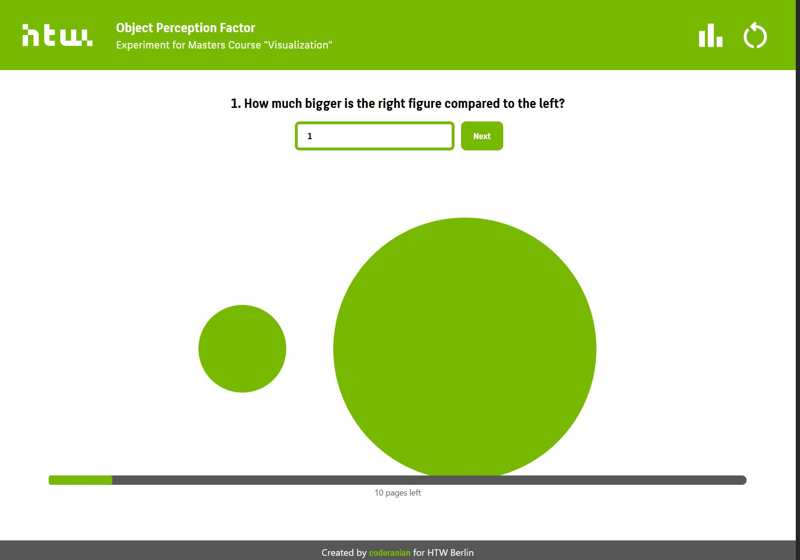
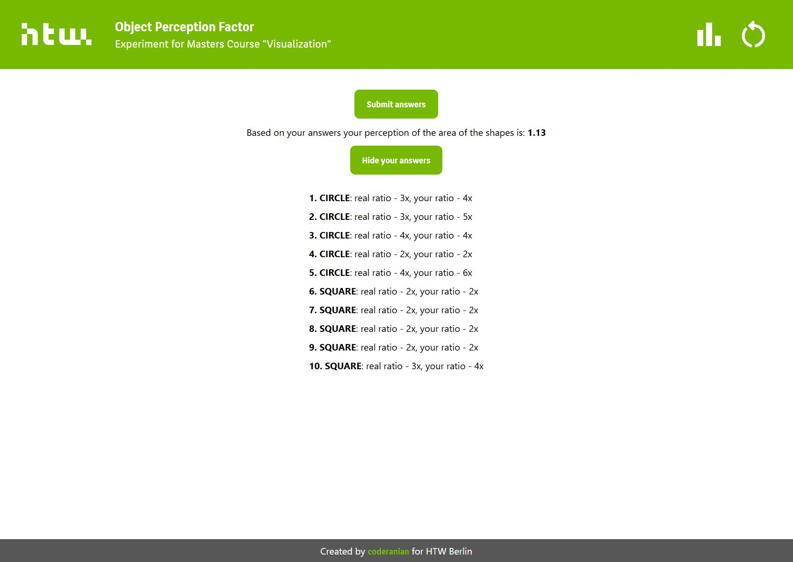
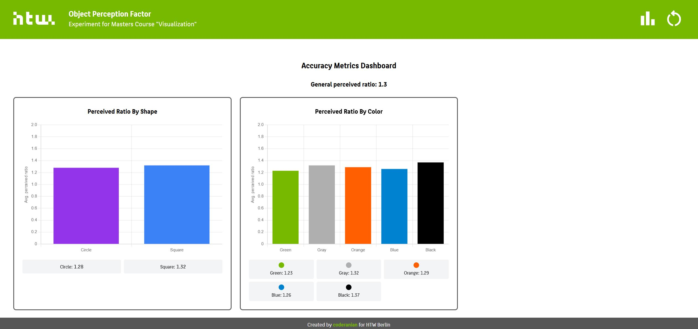
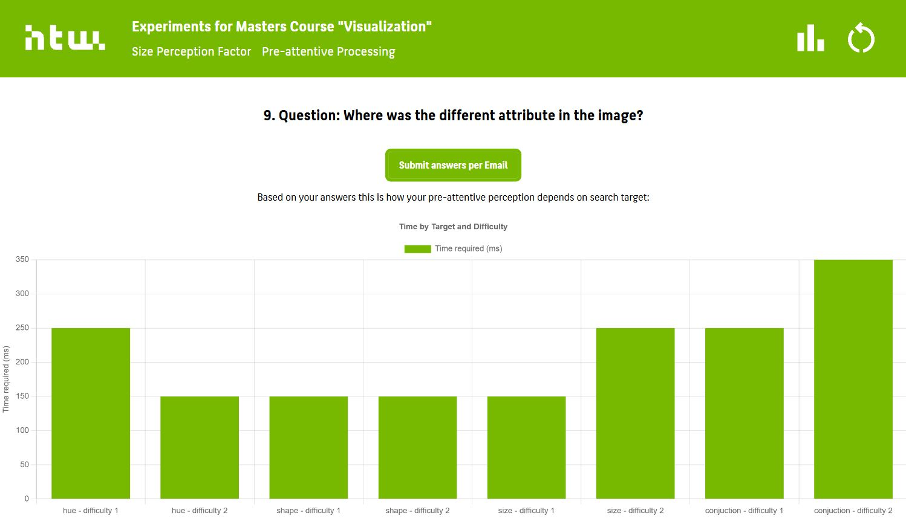
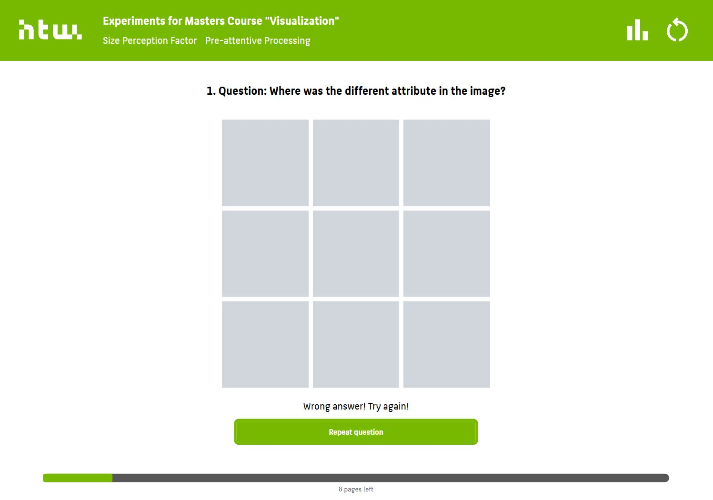

# visualization_exercise_1_perception

This Vue project has been deployed to collect data for a visualization course exercises.

## Project Setup

Node 16.14.2 or higher is required in order to install all the frontend dependencies.
1. Install all the dependencies.
```sh
npm install
```
2. Run the development server
```sh
npm run dev
```

## Project Structure
The project features components for the following two experiments:

### Experiment 1: Size Perception
Users will be asked to provide a perception of the size of the figures (circles and squares).
Due to small amount of participants, the answers were submitted via email without backend server and added to results.js manually.




### Experiment 1: Preattentive Processing
Users will be asked to view grid with various setup of targets and distractors and select the image segment with the target attribute.
Due to small amount of participants, the answers were submitted via email without backend server and added to results.js manually.



